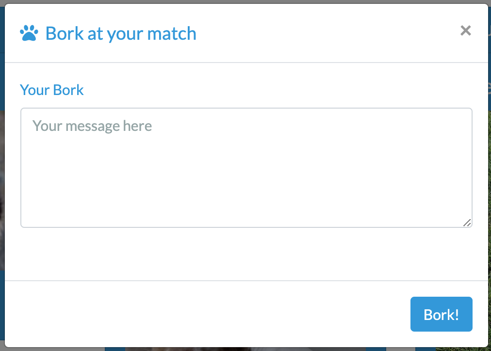

# Pupper-2

For this application our group used MongoDB, React, Express, Node.js, AuthO (signin authentication), OAuth2 (email authentication), AWS (image bucket) and NodeMailer. Styling was accomplished by using Bootswatch, Bootstrap and Reactstrap. 

* About Pupper *
Dog parks can be chaotic and overwhelming or just not the right setting for your dog to enjoy play. This is where Pupper steps in. Pupper is an app that takes in information about the owner and the dog and matches them with other dogs that may be a good fit, based on the owner's ideal playmate. 

When visiting our site, the user is first prompted to sign in or sign up.
    * Using AuthO, a log-in feature will attempt to connect you to your email address or create an account.

Once the log in credentials are correct, the user will be granted access to the site. To get started, a navbar will appear with routed options.

**Add Profile** will lead the user to create a new profile for their pet. In this view, the user will need to answer all *required* fields and dog characteristic questions (if they wish to find an accurate match). Once the user submits the next profile, it will lead to the matches page.

**My Profile** will lead the user to their profile if they've created one displaying their dog's photo with the survey questions they have answered. If they have not completed this already, a message will appear. If a profile is visible, the user will have the option of removing a profile and/or editing the fields.

**Matches** will lead the user to find their matches in the database based on three common pupper characteristics: 
* Desired size of playmate
* Desired Energy
* Dominancy

 
After submission of the form, pupper will display the most ideal playmates based on survey answers.

The owner will have two options once matches have been found:
* If the owner wishes to contact a pupper from the results, they can click the "Contact" button that will prompt a contact modal. 
* If the owner wishes to find more matches with other filtering, they can click "Find More Matches" taking them back to the previous page.

Once the owner has sent a message, the modal will close and an email will be sent directly to the user from "Pupper Contact". The email will include all text that was supplied in the contact modal. 

Deployed at: https://guarded-escarpment-41457.herokuapp.com/
*built and designed by Claudia Falk, Charlie Parsons, Carolyn Moneymaker and Jessica Sewell.

